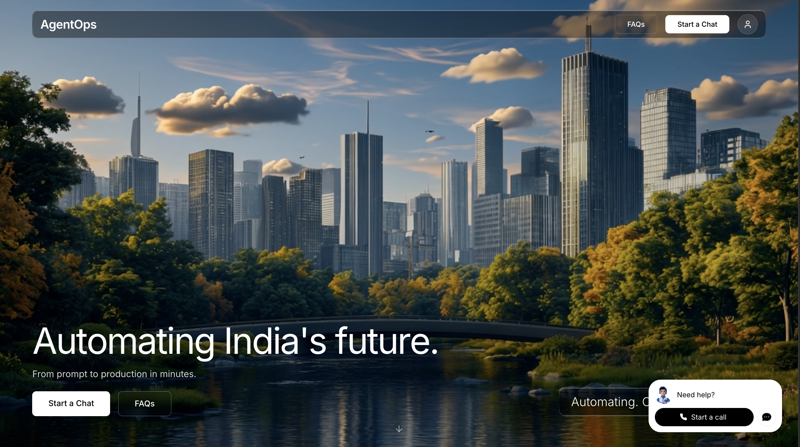
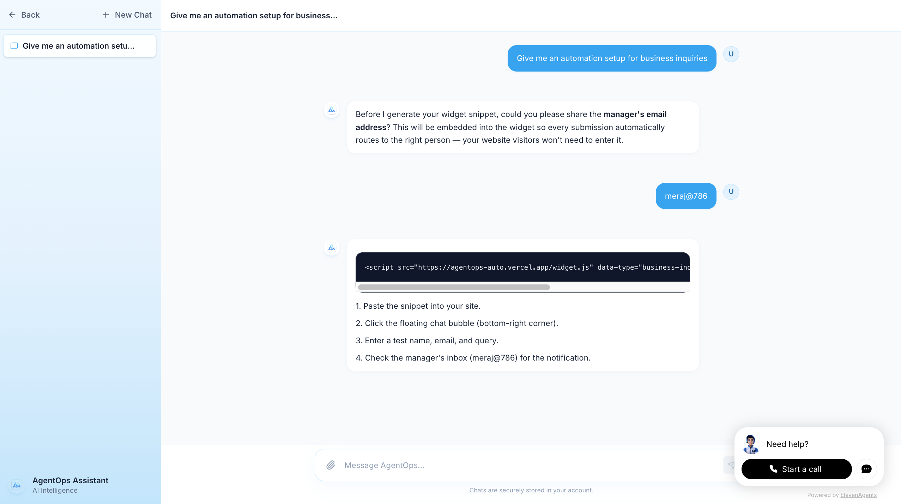
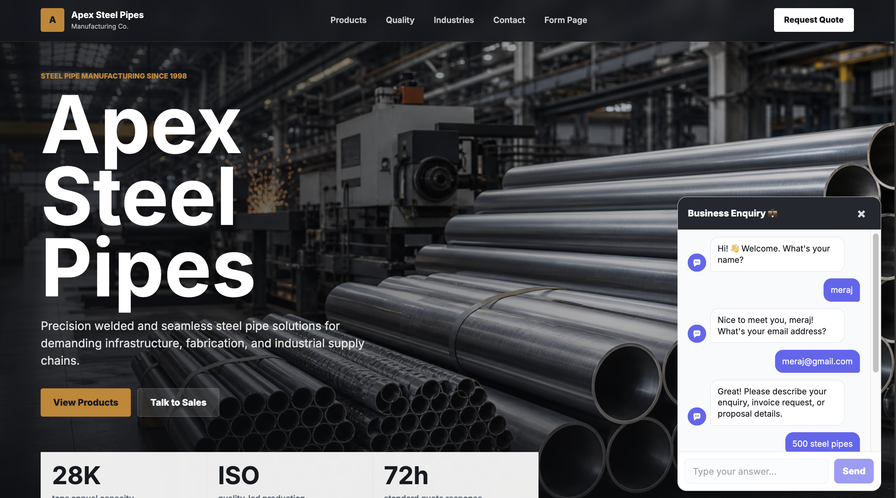
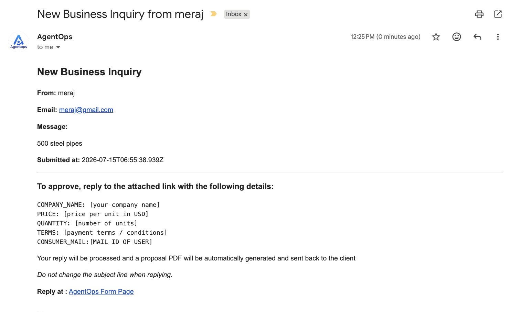

<div align="center">

# AgentOps

### Multi-Agent Business Automation Platform 

<b>
 Developed by :@merakstack,@shiva-code-og,@vignesh-0314,@navaneesh
</b>

<p>


</p>

</div>

---

## Overview

AgentOps is an AI-driven automation platform that connects customers, managers, and business workflows into a seamless pipeline.
Try at : https://agentops-auto.vercel.app/

## 🎥 Demo
<p align="center">
  <a href="https://www.loom.com/share/e5edc11a5a194ef9855af41bc78a4c51">
    
  </a>
</p>

<b>Sample Workflow:</b>
```
Customer Inquiry
       │
       ▼
   Manager Approval
       │
       ▼
 Proposal Generation
       │
       ▼
   PDF Proposal
       │
       ▼
 Customer Approval
       │
       ▼
 Invoice Generation
       │
       ▼
  Invoice Delivered
```


---

## ✨ Features

* 🤖 AI-powered workflow automation
* 📩 Automated business inquiry handling
* 📄 Proposal & Invoice PDF generation
* ✅ Manager and customer approval flows
* 📧 Gmail integration
* 🗄️ Supabase database integration
* ⚡ n8n workflow orchestration
* 🌐 Next.js API backend

---

##  Tech Stack

<p align="center">

Next.js • n8n • Supabase • Gmail API • HTML2PDF • JavaScript • Vercel • Groq

</p>

---
---

# 🖼️ Project Screenshots

<p align="center">
  
  
</p>

<p align="center">
  
  
</p>

---

# 🚀 Installation Guide

## Prerequisites

Make sure you have the following installed:

- Node.js (v18 or later)
- npm / yarn / pnpm
- Git
- Supabase Project
- n8n Instance
- Gmail API Credentials

---

## 1. Clone the Repository

```bash
git clone https://github.com/merajstack/AgentOps.git
cd AgentOps
```

---

## 2. Install Dependencies

Using npm

```bash
npm install
```

Or using pnpm

```bash
pnpm install
```

Or using yarn

```bash
yarn install
```

---

## 3. Configure Environment Variables

Create a `.env.local` file in the project root.

```env
NEXT_PUBLIC_SUPABASE_URL=your_supabase_url
NEXT_PUBLIC_SUPABASE_ANON_KEY=your_supabase_anon_key

SUPABASE_SERVICE_ROLE_KEY=your_service_role_key

N8N_WEBHOOK_URL=your_n8n_webhook

GMAIL_CLIENT_ID=your_client_id
GMAIL_CLIENT_SECRET=your_client_secret
GMAIL_REFRESH_TOKEN=your_refresh_token
GMAIL_USER=your_email
```

Update the values according to your setup.

---

## 4. Run the Development Server

```bash
npm run dev
```

Open

```
http://localhost:3000
```

---

## 5. Build for Production

```bash
npm run build
npm start
```

---

## 📂 Project Structure

```text
AgentOps/
│
├── app/
├── components/
├── public/
│   ├── rm1.png
│   ├── rm2.png
│   ├── rm3.png
│   └── rm4.png
├── lib/
├── styles/
├── .env.local
├── package.json
└── README.md
```

---

## 🔧 Workflow Setup

1. Configure your Supabase database.
2. Import the n8n workflow.
3. Configure Gmail API credentials.
4. Update environment variables.
5. Deploy the Next.js application to Vercel (or any hosting platform).
6. Connect the n8n webhook URL with the frontend.

---

## 🤝 Contributing

Contributions are welcome!

```bash
# Fork the repository

# Create a feature branch
git checkout -b feature/amazing-feature

# Commit your changes
git commit -m "Add amazing feature"

# Push to your branch
git push origin feature/amazing-feature
```

Then open a Pull Request.

---

## 📄 License

This project is licensed under the MIT License.

<div align="center">

### ⚡ Automate. Approve. Generate. Deliver.

**AgentOps transforms repetitive business operations into intelligent, automated workflows.**

</div>
